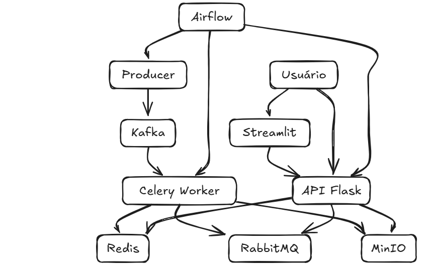

<div align="center"><h1>Air Quality Data Pipeline</h1></div>

<p>
Pipeline completo para ingestão, processamento, cache, armazenamento, geração de alertas e visualização de dados de qualidade do ar, utilizando arquitetura distribuída com Kafka, Redis, RabbitMQ, MinIO, Flask, Celery, Airflow e Streamlit.
</p>

<div align="center"><h2>🐍 Ferramentas e Linguagens Utilizadas 🐍</h2></div>

<div align="center">
  <br>
  
</div>

<div align="center"><h2>Resumo</h2></div>

<p>
Este projeto implementa um pipeline de dados orientado a eventos para o monitoramento da qualidade do ar. Ele cobre desde a ingestão via Kafka até a visualização em tempo real via Streamlit, passando por processamento assíncrono com Celery, armazenamento em cache (Redis), arquivamento (MinIO) e alertas (RabbitMQ). Tudo é orquestrado por DAGs no Airflow.
</p>

<div align="center"><h2>Descrição</h2></div>

<p>
Este projeto implementa uma arquitetura robusta e escalável para ingestão e análise de dados ambientais. O fluxo começa com um Producer lendo dados de um dataset CSV e enviando-os ao Kafka. Um Worker com Celery consome e processa os dados, armazenando resultados em Redis (cache) e MinIO (data lake), além de emitir alertas críticos para o RabbitMQ. Uma API Flask unifica o acesso aos dados e o Airflow orquestra todo o pipeline. Por fim, o Streamlit oferece um dashboard em tempo real com as leituras dos sensores. Ideal para projetos de IoT, dados em tempo real e visualização analítica.
</p>

<div align="center">
  
</div>

<div align="center"><h2>O que foi desenvolvido</h2></div>

- Leitor de dados (Producer Kafka)
- Consumidor com processamento assíncrono (Celery)
- Armazenamento em Redis (cache) e MinIO (histórico)
- Geração de alertas com RabbitMQ
- API REST com Flask
- Orquestração de tarefas com Airflow
- Dashboard em tempo real com Streamlit

<div align="center"><h2>Estrutura do Projeto</h2></div>

```
├── LICENSE
├── .gitignore
├── README.md
├── streaming_sim.png
├── pipeline/
│    ├── pipeline/
│    │   ├── __init__.py
│    │   ├── alert_handler.py
│    │   ├── config.py
│    │   ├── consumer.py
│    │   ├── pipeline.py
│    │   ├── producer.py
│    │   ├── storage.py
│    │   └── utils.py
│    ├── streamlit_app/
│    │   └── app.py
│    ├── Dockerfile
│    ├── README.md
│    ├── airquality.csv
│    ├── docker-compose.yml
│    ├── test.py
│    ├── requirements.txt
```

<div align="center"><h2>Execução do Projeto</h2></div>

```bash
# 1. Clone o repositório
git clone https://github.com/sarapacheco-user/AirQualityPipeline.git
cd AirQualityPipeline

# 2. Atualize dependências do sistema
sudo apt-get update && sudo apt-get install -y libjpeg-dev zlib1g-dev

# 3. Crie e ative um ambiente virtual
python3 -m venv venv
source venv/bin/activate

# 4. Limpe e instale os pacotes do projeto
pip cache purge
pip install --no-cache-dir -r requirements.txt

# 5. Suba os containers com Docker Compose
docker-compose up -d --build

# 6. Execute o Streamlit
streamlit run streamlit_app/app.py
